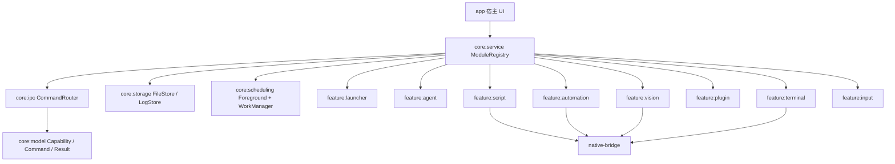

# 合并底层架构

## 目标

把两个 APK 的能力重写到一个宿主 APK 中，但保持底层边界清晰：

- 打工仔启动器侧：启动器、UPD/Agent、QTermux、保活、日志、配置。
- 月光宝盒侧：脚本引擎、Lua/native engine、UI 自动化、OCR/图像识别、插件、输入、文件代理。

新架构采用“单宿主 APK + 多 Gradle module + 多进程隔离 + 统一命令总线”。

## 总体结构



## 模块分层

| 层 | 模块 | 职责 |
| --- | --- | --- |
| 宿主层 | `app` | 主界面、权限引导、功能入口、服务启动、状态展示 |
| 核心模型 | `core:model` | 能力描述、命令、结果、错误码、审计事件 |
| IPC/命令层 | `core:ipc` | 统一 `CommandRouter`，替代散落的 `sendCMD/sendCmd` |
| 服务编排 | `core:service` | 模块注册、生命周期、依赖注入边界 |
| 存储 | `core:storage` | 文件、脚本、日志、模型、插件包统一管理 |
| 调度 | `core:scheduling` | 前台服务、WorkManager、用户可见的 boot/startup |
| 启动器 | `feature:launcher` | 原启动器入口、节点状态、功能面板 |
| Agent | `feature:agent` | 配置同步、版本检查、任务拉取、日志上报 |
| 脚本 | `feature:script` | Lua/脚本生命周期、脚本项目、脚本代理 |
| 自动化 | `feature:automation` | Accessibility、UI selector/object/action |
| 视觉 | `feature:vision` | 截图、OCR、YOLO、OpenCV/ONNX/NCNN bridge |
| 插件 | `feature:plugin` | 签名插件加载、插件生命周期、插件事件 |
| 终端 | `feature:terminal` | 受控终端 session，默认只允许本地调试/白名单命令 |
| 输入 | `feature:input` | IME、key/touch 事件、文本输入 |
| native | `native-bridge` | `.so` 加载、JNI wrapper、native process 守护边界 |

## 进程模型

建议至少拆 4 个进程：

| 进程 | 放置模块 | 理由 |
| --- | --- | --- |
| 主进程 | `app`, `launcher`, `agent` 轻量部分 | 保持 UI 稳定，避免 heavy native 崩溃拖死主界面 |
| `:engine` | `script`, `vision`, `native-bridge` | Lua/native/OCR/模型推理内存大，独立崩溃恢复 |
| `:automation` | `automation`, `input` | Accessibility/IME 生命周期特殊，和脚本引擎解耦 |
| `:plugin` | `plugin` | 插件 classloader 风险最高，单独隔离，便于卸载重启 |

不建议把所有能力放主进程。原因：两个 APK 都有 native、动态加载、服务保活、命令分发，合并后崩溃面会明显扩大。多进程能让脚本崩了不影响主 UI，插件崩了不影响 OCR，native 崩了还能由主进程重启。

## 命令总线

原 APK 里存在两套命令入口：

- 打工仔：字符串命令 `sendCMD(String, Map)`。
- 月光宝盒：整数命令 `sendCmd(int,int,int,String)`。

新架构统一成：

```kotlin
data class RuntimeCommand(
    val target: String,
    val action: String,
    val args: Map<String, String>,
    val payload: String?
)
```

理由：

- 字符串 action 更适合后期维护和审计。
- `target` 把 agent/script/vision/plugin/terminal 明确分开。
- `args` 替代多层 `i/i2/i3`，避免同一个数字在不同进程含义不同。
- `CommandRouter` 可集中做权限、签名、白名单、日志。

## 为什么不能直接硬合并反编译代码

1. 包名和资源冲突：两个 APK 都有 provider、service、资源名、第三方库，直接合并会出现 manifest/resource/class 冲突。
2. 进程生命周期冲突：一个偏 UPD/保活/终端，一个偏脚本/native/自动化，直接放一起会互相拉起、互相杀进程。
3. native 库冲突：两边都有 `.so`，ABI、加载顺序、JNI name、全局状态都可能冲突。
4. 命令协议冲突：一个是字符串命令，一个是整数命令，同号命令在不同层含义不同。
5. 权限风险过大：短信、电话、定位、悬浮窗、无障碍、安装包、root、shell 不能全部默认打开，应按功能显式申请。
6. 后期替换服务器困难：如果把后端地址和命令逻辑散落在各模块，之后换 APPID/服务器会重复改很多处。

## 推荐落地顺序

1. 先完成 `core:model`, `core:ipc`, `core:service`。
2. 接入 `feature:launcher` 和 `feature:agent`，实现配置同步、日志、任务状态。
3. 接入 `feature:script`，先跑最小脚本生命周期：安装、启动、停止、日志。
4. 接入 `native-bridge` 和 `feature:vision`，先做截图和 OCR，再做 YOLO。
5. 接入 `feature:automation` 和 `feature:input`，要求用户显式授权无障碍和输入法。
6. 最后接入 `feature:plugin` 和 `feature:terminal`，并默认关闭高风险能力。

